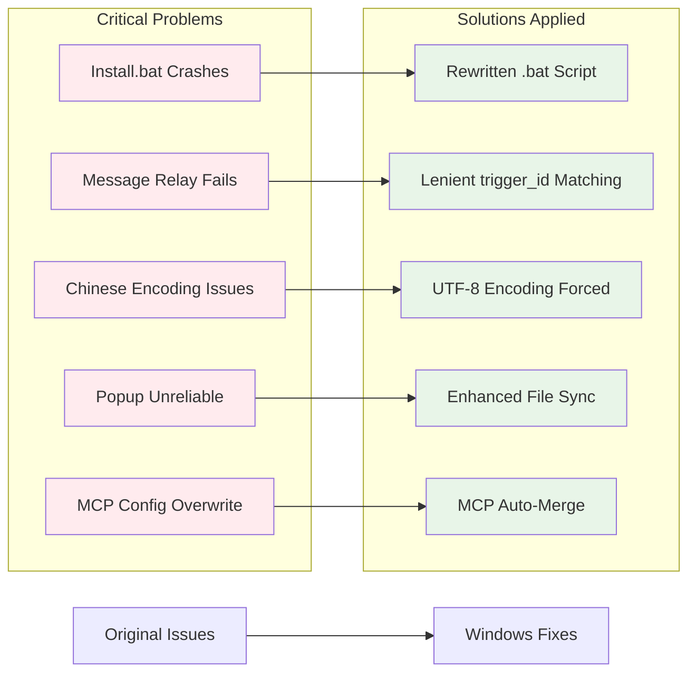

# Windows 11 Compatibility Fixes - Critical Issues Resolved

## Overview
I've created a Windows 11 optimized version that fixes several critical issues preventing Review Gate V2 from working properly on Windows systems. The original installation script crashes immediately, and message relay functionality is broken.

### 🔧 Problem-Solution Map

## Critical Issues Fixed

### 🔧 **Message Relay Failure** 
- **Problem**: Popups trigger correctly but user messages can't be sent back to Cursor AI
- **Cause**: Strict `trigger_id` validation and missing UTF-8 encoding in `_wait_for_user_input`
- **Fix**: Implemented lenient matching and enforced UTF-8 encoding for all file operations

### 💻 **Installation Script Crash**
- **Problem**: `install.bat` crashes immediately on Windows due to syntax errors
- **Cause**: Batch script syntax issues, empty `args` array in JSON generation, poor error handling
- **Fix**: Completely rewrote installation script with robust error handling and proper Windows path support

### 🌏 **Chinese Encoding Issues**
- **Problem**: Chinese characters cause parsing failures and garbled text
- **Fix**: Added `"PYTHONIOENCODING":"utf-8"` to mcp.json and enforced UTF-8 in all Python scripts

### 🚀 **Unreliable Popup Triggering**
- **Problem**: Popup mechanism unreliable on Windows file systems
- **Fix**: Enhanced trigger logic with filesystem sync and proper Windows file locking

## Additional Windows 11 Optimizations
- Proper Windows path separator handling (`\` vs `/`)
- Enhanced temporary file management for Windows permission system
- Chinese speech recognition support
- Comprehensive error logging and recovery mechanisms
- **MCP Configuration Auto-Merge**: The `install.bat` script now intelligently merges `mcp.json` configurations, safely adding Review Gate's services without overwriting existing MCP setups.

## Testing Results
✅ Installation completes successfully without crashes  
✅ Message relay works bidirectionally  
✅ Chinese character input/output functions properly  
✅ Popup triggering is reliable and consistent  

## Repository
Fixes available at: https://github.com/zlcggb/Review-Gate-win11-chinese

## Request
Would you consider merging these Windows compatibility fixes into the main repository? This would make Review Gate V2 accessible to the Windows user community, as the current version is non-functional on Windows systems.

The changes maintain full backward compatibility while significantly improving Windows reliability. 