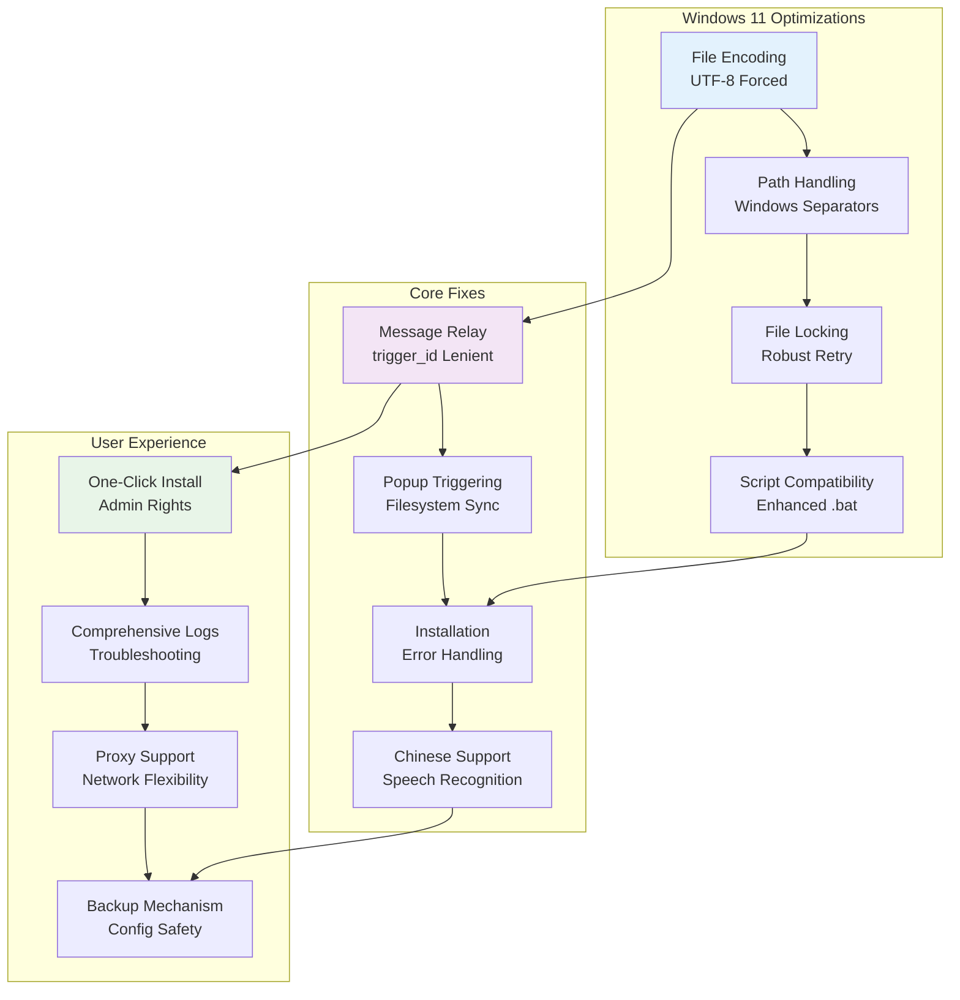

# Improvements Made to Review Gate V2 for Windows 11 Compatibility

## Summary

I've created a Windows 11 optimized version of Review Gate V2 that addresses several critical issues found in the original implementation, particularly focusing on Windows environment compatibility, Chinese character encoding, and installation reliability.

### 🏗️ Architecture Overview

## Key Issues Fixed

### 1. **Critical Message Relay Bug Fix** 🔧
**Problem**: The original `review_gate_v2_mcp.py` could trigger popups successfully, but user messages input in the popup couldn't be relayed back to the Cursor AI chat.

**Root Causes**:
- Overly strict `trigger_id` validation in `_wait_for_user_input` method
- Missing UTF-8 encoding specification when reading response files
- Insufficient file handling robustness causing message relay failures

**Solution**: 
- Implemented more lenient `trigger_id` matching to support generic response files
- Forced UTF-8 encoding for all file read/write operations
- Added immediate file cleanup after processing responses
- Enhanced error handling and logging for better debugging

### 2. **Chinese Character Encoding Issues** 🌏
**Problem**: Chinese characters and other non-ASCII characters caused parsing failures and garbled text.

**Solution**:
- Added `"PYTHONIOENCODING":"utf-8"` to `mcp.json` configuration
- Enforced UTF-8 encoding in both `review_gate_v2_mcp.py` and `review_gate_v2_mcp_fixed.py`
- Ensured all file operations use explicit UTF-8 encoding

### 3. **Installation Script Failures** 💻
**Problem**: The original one-click installation would crash immediately and fail to complete installation on Windows systems.

**Issues Found**:
- Batch script syntax errors causing immediate termination
- Empty `args` array in `mcp.json` generation
- Missing error handling for Python environment detection
- Inadequate Windows path handling

**Solutions**:
- Completely rewrote `install.bat` with robust error handling
- Fixed JSON generation syntax issues
- Added automatic Python environment detection and validation
- Implemented proper Windows path handling with backslashes
- Added automatic backup mechanism for existing `mcp.json` files
- Included dependency installation with proxy support options

### 4. **Popup Trigger Mechanism Enhancement** 🚀
**Problem**: Popup triggering was unreliable on Windows due to file system differences.

**Solution**:
- Ported robust trigger logic with filesystem synchronization
- Implemented multiple backup trigger file mechanisms
- Added proper file locking and retry mechanisms for Windows
- Enhanced cross-platform compatibility

### 5. **Windows 11 Specific Optimizations** 🪟
- Optimized for Windows file locking and permission management
- Enhanced temporary file handling for Windows environment
- Improved script compatibility with Windows PowerShell and Command Prompt
- Added support for Windows-specific path separators and encoding

## Additional Improvements

### Enhanced User Experience
- **Chinese Speech Recognition**: Added support for Chinese language speech-to-text
- **Better Error Reporting**: Comprehensive logging system for troubleshooting
- **User-Friendly Installation**: Clear step-by-step installation guide with backup recommendations
- **Proxy Configuration**: Optional proxy support for restricted network environments

### Technical Enhancements
- **Robust File Operations**: Better handling of concurrent file access
- **Cross-Platform Compatibility**: Addressed Windows-specific file system behaviors
- **Memory Management**: Improved cleanup of temporary files and resources
- **Error Recovery**: Better error handling and recovery mechanisms

## Testing and Validation
- Extensively tested on Windows 11 environment
- Verified message relay functionality works correctly
- Confirmed Chinese character input/output works properly
- Validated installation process completes successfully
- Tested both original and fixed MCP server versions

## Files Modified/Added
- `install.bat` - Completely rewritten for Windows compatibility
- `review_gate_v2_mcp.py` - Enhanced with robust message relay logic
- `review_gate_v2_mcp_fixed.py` - Optimized version with additional safeguards
- `mcp.json` - Corrected configuration with proper encoding settings
- `README.md` - Comprehensive English documentation
- `readme_cn.md` - Detailed Chinese documentation

## Impact
These improvements make Review Gate V2 fully functional on Windows 11 systems, resolving the critical installation and message relay issues that prevented the original version from working properly in Windows environments. The changes maintain backward compatibility while significantly improving reliability and user experience.

## Repository
The improved version is available at: https://github.com/zlcggb/Review-Gate-win11-chinese

Would you consider incorporating these fixes into the main repository to benefit the broader Windows user community? 