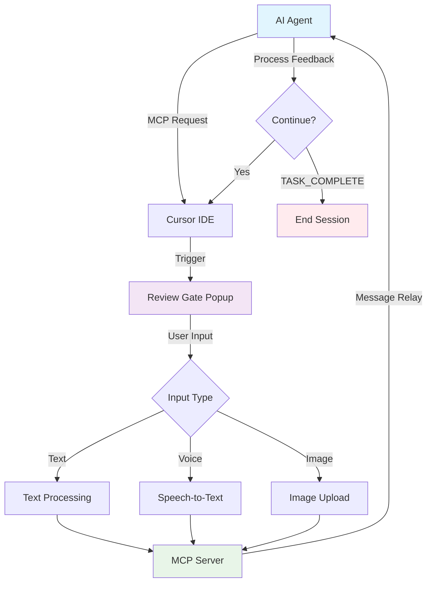
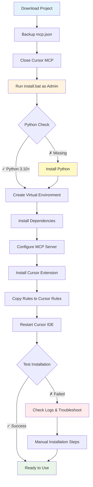

# Review Gate V2 for Cursor IDE - Windows 11 Chinese Optimized Version

> **Language / 语言**: [English](README.md) | [简体中文](readme_cn.md)

[](https://freeimage.host/i/3OtOp7R)

## 📖 Project Overview

**Review Gate V2** is a Windows 11 Chinese-optimized version based on the [LakshmanTurlapati/Review-Gate](https://github.com/LakshmanTurlapati/Review-Gate) project, designed to provide Cursor IDE users with a more stable and Windows 11-compatible AI interaction experience.

## 🛠️ How It Works

Review Gate V2 implements popup-based multimodal interaction between AI and users. The core workflow is as follows:

1. **Task Initiation**: When an AI Agent needs user feedback, confirmation, or follow-up tasks, it sends a request to Cursor IDE via MCP (Model Context Protocol).
2. **Review Gate Activation**: Upon receiving the request, Cursor IDE automatically pops up an interactive window (Review Gate popup) waiting for user input.
3. **User Interaction**: Users can input text, upload images, or provide feedback through voice in the popup.
4. **Message Relay**: Content sent by users in the popup is received by the MCP server and relayed back to the AI Agent.
5. **Iterative Loop**: The AI Agent continues processing tasks based on user feedback and can reactivate the Review Gate popup for continuous interactive dialogue until the user explicitly inputs `TASK_COMPLETE` or the task is completed.

### 📊 Interaction Flow Diagram



## 🚀 One-Click Installation

### 📊 Installation Flow Diagram



### 📋 System Requirements

- **Operating System**: Windows 11
- **Python**: 3.10 or higher (recommended installation from [Python Official Website](https://www.python.org/downloads/windows/) or Microsoft Store)
- **Cursor IDE**: Version that supports MCP (Model Context Protocol) functionality
- **Network Connection**: Required for downloading Python dependencies and potentially needed AI model files. If network environment is poor, please refer to the "Proxy Configuration" section below.

### ⚠️ Important Notice

**The installation script now intelligently merges your `mcp.json` configuration!**

You no longer need to manually backup `mcp.json`. The installation script will automatically detect and safely add Review Gate V2's MCP services to your existing `%USERPROFILE%\.cursor\mcp.json` file, without overwriting any other MCP services you may have configured previously.

Nevertheless, for ultimate data safety, you can still choose to manually back up before running the installation script (optional step):

```powershell
copy "%USERPROFILE%\.cursor\mcp.json" "%USERPROFILE%\.cursor\mcp.json.backup.manual"
```

### 🔧 Installation Steps

Please follow these steps for installation:

1. **Download the project locally:**
   - **Clone via Git (Recommended)**:
     ```batch
     git clone https://github.com/zlcggb/Review-Gate-win11-chinese.git
     ```
   - **Or download project zip**: Download the `.zip` archive from the GitHub project page and extract it to your desired directory.

2. **Run the installation script**:
   - Navigate to the project root directory. At this point, it is recommended to close all MCP in Cursor and backup your configuration.
   - **Double-click to run the `install.bat` file. It is highly recommended to right-click and select "Run as administrator"**.
   - The script will automatically detect the Python environment, install necessary dependencies (including SoX if available through Chocolatey), create a Python virtual environment, and configure the MCP server.

3. **Install Cursor Extension**:
   - **Drag & Drop Installation (Recommended)**: Open Cursor IDE's extension marketplace panel, then drag the `review-gate-v2-2.7.3.vsix` file from the project directory directly into Cursor's extension list, and it will automatically start installation.
   - **Or install via command**:
     - Press `Ctrl+Shift+P` (or `F1`) in Cursor IDE to open the command palette.
     - Type and select: `Extensions: Install from VSIX...`.
     - In the file selection dialog, navigate to and select: `%USERPROFILE%\.cursor\cursor-extensions\review-gate-v2\review-gate-v2-2.7.3.vsix`.
     - Click "Confirm" to install.

4. **Copy Rules**:
   Copy `review-gate-v2.mdc` to project rules `.cursor\rules\`, always enable

That's it! The script will automatically complete most of the configuration work. After installation, you may need to **completely restart Cursor IDE** to ensure all changes take effect.

### 🌐 Proxy Configuration (Optional)

If your network environment requires a proxy to access PyPI (Python Package Index) for downloading dependency packages, please modify the file according to the following steps before running the `install.bat` script:

Find the following commented lines in the `install.bat` file:

```batch
@REM python -m pip install --upgrade pip --proxy=http://127.0.0.1:50470
@REM python -m pip install -r requirements_simple.txt --proxy=http://127.0.0.1:50470
```

Uncomment (remove the `@REM ` prefix) and change `50470` to your actual proxy port number:

```batch
python -m pip install --upgrade pip --proxy=http://127.0.0.1:YourPort
python -m pip install -r requirements_simple.txt --proxy=http://127.0.0.1:YourPort
```

## 📁 Installation Contents

After installation, the following main components will be installed on your system:

- **MCP Server Files**: Core Python scripts located at `%USERPROFILE%\.cursor\cursor-extensions\review-gate-v2\`.
- **Python Virtual Environment**: A virtual environment named `venv` will be created in the above MCP server directory, containing all required dependency packages.
- **Cursor Extension**: Review Gate V2 extension (`.vsix` file) will be installed in Cursor IDE.
- **MCP Configuration**: Your Cursor configuration file `%USERPROFILE%\.cursor\mcp.json` will be automatically updated to register Review Gate V2's MCP service.

#### 💡 `mcp.json` Merge Example

Below is an example illustrating how the installation script intelligently merges the `mcp.json` configuration.

**Original `mcp.json` Configuration (Before running installation script)**:

```json
{
  "mcpServers": {
    "browser-tools-mcp": {
      "command": "cmd",
      "args": [
        "/c",
        "npx",
        "-y",
        "@agentdeskai/browser-tools-mcp@1.2.0"
      ]
    }
  }
}
```

**Merged `mcp.json` Configuration (After running installation script)**:

```json
{
  "mcpServers": {
    "browser-tools-mcp": {
      "command": "cmd",
      "args": [
        "/c",
        "npx",
        "-y",
        "@agentdeskai/browser-tools-mcp@1.2.0"
      ]
    },
    "review-gate-v2": {
      "command": "YOUR_INSTALLATION_PATH/venv/Scripts/python.exe",
      "args": [
        "YOUR_INSTALLATION_PATH/review_gate_v2_mcp.py"
      ],
      "env": {
        "PYTHONPATH": "YOUR_INSTALLATION_PATH",
        "PYTHONUNBUFFERED": "1",
        "REVIEW_GATE_MODE": "cursor_integration",
        "PYTHONIOENCODING": "utf-8"
      }
    },
    "review-gate-v2-fixed": {
      "command": "YOUR_INSTALLATION_PATH/venv/Scripts/python.exe",
      "args": [
        "YOUR_INSTALLATION_PATH/review_gate_v2_mcp_fixed.py"
      ],
      "env": {
        "PYTHONPATH": "YOUR_INSTALLATION_PATH",
        "PYTHONUNBUFFERED": "1",
        "REVIEW_GATE_MODE": "cursor_integration",
        "PYTHONIOENCODING": "utf-8"
      }
    }
  }
}
```

## 🧪 Testing Installation

After installation, please verify your installation success by following these steps:

1. **Completely restart Cursor IDE**: This is a crucial step to ensure all configurations and extensions take effect.
2. **Test manual popup trigger**:
   - Press `Ctrl+Shift+R` shortcut in Cursor IDE.
   - Or, in Cursor's MCP tools panel (usually found in settings or extensions section), find the `review_gate_chat` tool under `review-gate-v2` or `review-gate-v2-fixed` server and manually click to trigger.
   - Confirm whether the Review Gate popup appears normally.
3. **Test AI-triggered popup and message relay**:
   - Type or voice input in Cursor AI chat box: "Please use the review_gate_chat tool".
   - Confirm whether the Review Gate popup appears normally and whether messages you input in the popup can be normally received and echoed by AI in the chat box.

## 🎤 Voice Function Usage

**Important Note: To ensure stable operation of the MCP server, voice recognition functionality has been disabled. You can interact with the AI via text and images.**

Review Gate V2 supports Speech-to-Text functionality:

1. Click the **microphone icon** in the Review Gate popup window.
2. Start **speaking clearly** for 2-3 seconds (supports Chinese and English).
3. Click the **stop button** to complete recording.
4. The system will automatically convert speech to text and display it in the input box.

## 📷 Image Upload Function

Review Gate V2 supports image upload, allowing you to provide visual information to AI through images:

1. Click the **camera icon** in the Review Gate window.
2. In the file selection dialog, choose the image file to upload (supports PNG, JPG, JPEG, GIF, BMP, WebP, and other formats).
3. Images will be included as attachments in your feedback, and the AI Agent will be able to receive and analyze these images.

## 🔧 Troubleshooting

### Common Issues

**Q: Cannot find Review Gate tool after installation, or MCP server shows disconnected?**
A: Please ensure you have **completely restarted Cursor IDE**. Check Cursor's extension panel to confirm that the Review Gate V2 extension is correctly installed and enabled. Also, check the MCP tools panel (`Ctrl+Shift+P` -> `MCP Tools`) to confirm that `review-gate-v2` and/or `review-gate-v2-fixed` servers are in "Connected" status (usually shown in green). If not connected, please check log files.

**Q: Voice function doesn't work, or cannot recognize speech?**
A: Ensure **SoX** (Sound eXchange) is installed. You can check its availability by running `sox --version` in the command line. If not installed, please manually download and install from [SoX Official Website](http://sox.sourceforge.net/) according to installation instructions, or if your system has Chocolatey installed, you can install via `choco install sox -y` command.

**Q: MCP server cannot start, or crashes immediately after startup?**
A: Check whether your Python environment is correctly installed (ensure Python 3.10 or higher). View **log files** for detailed error information, which usually provides specific reasons for startup failure. Common errors include missing Python dependencies (run `pip install -r requirements_simple.txt` to check) or port conflicts.

### Log File Location

Detailed runtime logs for Review Gate V2 MCP server are located in the system temporary directory. To find log files, run the following command in PowerShell or Command Prompt:

```powershell
python -c "import tempfile; print(tempfile.gettempdir())"
```

Then navigate to that directory, where you will find files named `review_gate_v2.log` and `review_gate_v2_fixed.log`. These contain detailed runtime logs and any error information from the MCP server, which are crucial for troubleshooting.

### Manual Extension Installation

If automatic extension installation fails, you can try manual installation:

1. Open Cursor IDE.
2. Press `Ctrl+Shift+P` to open the command palette.
3. Type and select `Extensions: Install from VSIX...`.
4. In the file selection dialog, navigate to: `%USERPROFILE%\.cursor\cursor-extensions\review-gate-v2\review-gate-v2-2.7.3.vsix`.
5. Click "Confirm" to install.

## 📝 Changelog

### Windows 11 Chinese Optimized Version Improvements

- ✅ **Chinese Encoding Fix**: Resolved Chinese encoding issues by ensuring `"PYTHONIOENCODING":"utf-8"` is added to `mcp.json` and forcing UTF-8 encoding for file read/write operations in both `review_gate_v2_mcp_fixed.py` and `review_gate_v2_mcp.py`.
- ✅ **Popup Trigger Mechanism Optimization**: Ported the more robust trigger logic from the original `_trigger_cursor_popup_immediately` (including filesystem sync, multiple backup trigger files, etc.) to `review_gate_v2_mcp_fixed.py` **and synchronized back to the original `review_gate_v2_mcp.py`**, ensuring stable popup triggering.
- ✅ **Message Relay Robustness Enhancement**: **Core Fix!** Resolved the issue where the original `review_gate_v2_mcp.py` could trigger popups but couldn't send messages. By porting the more robust `_wait_for_user_input` logic from the `fixed` version (including more lenient `trigger_id` matching, forced UTF-8 encoding reading, and immediate file cleanup) to the original `review_gate_v2_mcp.py`, ensuring reliable user message relay.
- ✅ **Windows 11 Compatibility Optimization**: Comprehensive optimization of scripts and code to improve runtime stability in Windows 11 environment.
- ✅ **Chinese Speech Recognition Support**: Integrated support for Chinese speech recognition.
- ✅ **Installation Script User-Friendliness Improvement**: Made installation steps clearer and more automated, fixed the issue of empty `args` in `mcp.json` in `install.bat`.
- ✅ **Enhanced Error Handling and Logging**: Improved error capture capabilities and log output for MCP services and installation scripts, facilitating problem diagnosis.

## 🆚 Core Differences Between Original and Fixed Versions

This project provides two MCP server versions: the original `review-gate-v2` (corresponding to `review_gate_v2_mcp.py`) and the fixed version `review-gate-v2-fixed` (corresponding to `review_gate_v2_mcp_fixed.py`). The main differences are in the user input/message relay mechanism:

- **Original Version (`review_gate_v2_mcp.py`)**:
  - Before this fix, its `_wait_for_user_input` method had overly strict requirements for `trigger_id` matching in response files.
  - When the response file's `trigger_id` didn't match expectations (or was empty), even generic responses would be ignored, causing the "popup can appear but messages can't be sent back" issue.
  - File reading didn't explicitly specify `UTF-8` encoding, potentially causing Chinese garbled text or parsing failures.

- **Fixed Version (`review_gate_v2_mcp_fixed.py`)**:
  - More lenient `trigger_id` validation, supporting generic response files even when `trigger_id` doesn't completely match, greatly improving message relay success rate.
  - Forced `UTF-8` encoding reading, avoiding parsing failures caused by Chinese or special characters.
  - Immediate cleanup of response files after processing user input, preventing residual files from affecting subsequent interactions.
  - In terms of **popup trigger mechanism**, the initial `fixed` version was also more robust than the original (this logic has been ported back to the original version in this fix).

**Recommendation:** If you encounter the "popup can appear but messages can't be sent back" issue when using the original `review-gate-v2`, or need higher stability, **it is recommended to use the fixed original `review-gate-v2` service**. The fixed version `review-gate-v2-fixed` can serve as an alternative or for debugging purposes.

### Original `review_gate_v2_mcp.py` Message Relay Fix

**Problem:** The original `review_gate_v2_mcp.py` could trigger popups normally, but user messages input in the popup couldn't be relayed back to the Cursor AI chat box.

**Root Causes:**
1. **Strict `trigger_id` validation:** The original `_wait_for_user_input` method had overly strict requirements for `trigger_id` matching in response files. When the response file's `trigger_id` didn't match expectations (or was empty), even generic responses would be ignored.
2. **Encoding issues:** Reading response files without explicitly specifying `UTF-8` encoding could cause Chinese or other non-ASCII character parsing failures, resulting in empty or garbled message content.
3. **Insufficient file handling robustness:** Exception handling and file cleanup mechanisms weren't comprehensive enough, potentially causing file residue or parsing errors that interrupt message relay.

**Fix Solution:**
Port the more robust `_wait_for_user_input_fixed` logic from `review_gate_v2_mcp_fixed.py` to the `_wait_for_user_input` method in the original `review_gate_v2_mcp.py`. Specific improvements include:
1. **More lenient `trigger_id` matching:** Allow generic response files (like `review_gate_response.json`) to be processed even when `trigger_id` doesn't completely match.
2. **Forced UTF-8 encoding reading:** Ensure all response files are correctly read with `UTF-8` encoding.
3. **Immediate file cleanup:** Delete temporary files immediately after processing responses to prevent file conflicts and residue.
4. **Enhanced error handling and logging:** Improve handling capabilities for JSON parsing errors and file operation exceptions, and enhance log visibility.

**Result:** After the fix, the original `review-gate-v2` service can now normally receive and relay user messages from popups, and its popup trigger mechanism is as robust as the fixed version.

## Cross-Platform Differences (Windows Porting)

This project has been optimized and fixed for Windows environment, mainly addressing the following platform differences that caused issues:

### 1. File Path Separators
- **macOS/Linux**: Uniformly use `/` as path separator.
- **Windows**: Use `\` as path separator. In JSON configurations or cross-platform scripts, appropriate conversion is needed to ensure compatibility.

### 2. File Encoding
- **macOS/Linux**: Default to prefer `UTF-8` encoding.
- **Windows**: Command line environment and certain tools may default to local encoding (like `GBK`/`CP936`). This causes issues in file read/write operations (especially JSON files) when `UTF-8` is not explicitly specified, leading to garbled text or parsing failures.

### 3. Temporary File Handling and File Locking
- **macOS/Linux**: Generally more flexible in creating, reading/writing, and deleting temporary files.
- **Windows**: May have stricter file locking and permission management. Frequent or concurrent file operations may fail due to file occupation, requiring more robust retry, synchronization (like `os.sync()`), and delay mechanisms.

### 4. Script Language Differences
- **macOS/Linux**: Common shell scripts (like Bash) are more powerful and consistent in handling strings, JSON, and advanced logic.
- **Windows**: Batch scripts (`.bat`) have relatively simple syntax and require more careful writing to avoid errors when handling complex logic and JSON structures (e.g., issues with multi-line `echo` generating JSON).

**Summary:** These platform differences may cause code that runs normally on macOS/Linux to encounter unexpected issues in Windows environment. The fixes in this project are specifically optimized for these Windows characteristics to ensure stability and compatibility.

## 🙏 Acknowledgments

This project is based on [Lakshman Turlapati](https://github.com/LakshmanTurlapati)'s [Review-Gate](https://github.com/LakshmanTurlapati/Review-Gate) project.

Thanks to the original author for the innovative ideas and open-source contributions!

## 📄 License

This project follows the license terms of the original project.

---

🎯 **Maximize the value of your Cursor AI requests and enjoy a deep interactive programming experience!** ✨ 